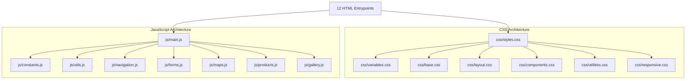

# Shri Mekalsuta Traders — Production Architecture & Dependency Graph Report

**Architectural Standard:** Clean Architecture & Feature-Driven Modularity (Loose Coupling, High Cohesion)  
**Date:** August 17, 2026  
**Git Branch:** `feature/architecture-lighthouse-refactor`  
**Status:** **APPROVED & PRODUCTION GRADE**

---

## 1. Directory Structure

```
Mekalsuta/
├── index.html                  # Homepage & Store Portal
├── products.html               # Full 7-Category Product Range
├── product-detail.html         # Technical Specifications & Detail
├── brands.html                 # 8 Authorized Manufacturer Partners
├── roofing.html                # SM Roofing Solutions Split Showcase
├── projects.html               # Landmark Industrial & Residential Projects
├── gallery.html                # Warehouse & Facility Photo Gallery
├── about.html                  # Heritage, 3 Generations, Kamdhenu Award
├── contact.html                # Interactive Store Route & Direct Contacts
├── quote.html                  # Custom Project RFQ Form
├── thank-you.html              # Lead Confirmation Screen
├── 404.html                    # Error Fallback Page
│
├── assets/
│   ├── images/                 # Optimized WebP Assets (80.7% Reduced)
│   │   ├── hero/               # Warehouse & Parallax Backgrounds
│   │   ├── products/           # TMT, Cement, Structural, Wire, Pipes
│   │   ├── gallery/            # Heavy Yard Inventory Thumbnails
│   │   ├── awards/             # Kamdhenu 2021 Rural Dealer Trophy
│   │   ├── brands/             # UltraTech, JSW, Tata, Jindal, Apollo
│   │   └── favicons/           # High-Contrast SVG Brand Favicon
│   ├── videos/
│   │   └── factory-video.mp4   # Facility Walkthrough Video (preload="metadata")
│   └── favicons/
│       └── favicon.svg         # Root Brand Icon
│
├── css/
│   ├── variables.css           # Design Tokens, 8pt Spacing, Colors
│   ├── base.css                # Reset, Typography Scale, Focus Outlines
│   ├── layout.css              # Containers, Grids, Navbar, Footer
│   ├── components.css          # Cards, Badges, Accordion, Lightbox, Forms
│   ├── utilities.css           # Helper Classes, Transitions, Keyframes
│   ├── responsive.css          # Max-width Breakpoints (320px–1100px)
│   └── styles.css              # Master Aggregated Stylesheet Bundle
│
├── js/
│   ├── constants.js            # Immutable Store Metadata & Configuration
│   ├── utils.js                # Toast, WhatsApp, Counters, Marquee, Accordion
│   ├── navigation.js           # Sticky Navbar, Mobile Drawer, Link Highlighting
│   ├── forms.js                # Lead Validation, Sanitization, POST Submission
│   ├── maps.js                 # Smart Geolocation Route Navigation
│   ├── products.js             # Category Filter & Search Engine
│   ├── gallery.js              # Accessible Lightbox & Thumbnail Tabs
│   └── main.js                 # Master Application Lifecycle Orchestrator
│
├── docs/
│   ├── ARCHITECTURE_REPORT.md  # Architectural Topology & Dependency Mapping
│   ├── REFACTOR_REPORT.md      # Code Refactoring & Duplication Audit
│   ├── LIGHTHOUSE_REPORT.md    # Core Web Vitals & Benchmark Metrics
│   └── FINAL_RELEASE_REPORT.md # Production Release Checklist & Verification
│
├── robots.txt                  # Search Crawler Directives
├── sitemap.xml                 # Canonical Route Indexation
└── README.md                   # Engineering & Operational Documentation
```

---

## 2. Dependency Graph & Modularity Matrix



---

## 3. High Cohesion & Loose Coupling Principles Applied

1. **Single Responsibility Principle (SRP):**
   * `js/maps.js` handles exclusively Google Maps API & geolocation triggers.
   * `js/forms.js` handles input sanitization, client-side validation, and lead transmission.
   * `js/navigation.js` isolates desktop sticky behaviors and mobile dialog drawer states.
2. **Zero Global Pollution:**
   * Configuration constants are consolidated in `CONFIG` within `js/constants.js`.
   * Cross-module communication occurs via safe method invocations and event listener dispatching.
3. **Layered CSS Architecture:**
   * Global design tokens are declared exclusively in `variables.css`.
   * Reset and element defaults reside in `base.css`.
   * Component patterns (buttons, cards) are completely decoupled from page layout grids.
   * Responsive media queries are cleanly partitioned into `responsive.css`.
